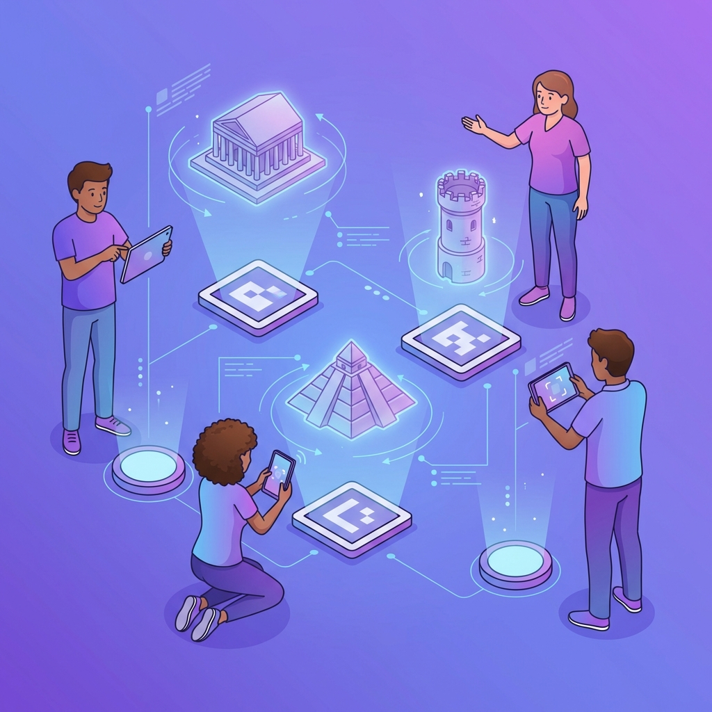

# 🏛️ AR Situs Bersejarah Dunia

Aplikasi Augmented Reality berbasis web untuk mengeksplorasi 8 situs bersejarah paling ikonik di dunia dalam bentuk 3D menggunakan teknologi AR.js dan A-Frame.



## ✨ Fitur Utama

### 🏠 Homepage Modern
- Landing page dengan desain modern dan responsive
- 4 menu navigasi utama dengan card design
- Animasi smooth dan gradient background
- Typography premium (Poppins + Inter fonts)

### 📚 Informasi Situs
Jelajahi informasi lengkap 8 situs bersejarah dunia:
1. **Candi Borobudur** - Indonesia
2. **Piramida Agung Giza** - Mesir
3. **Taj Mahal** - India
4. **Ad Deir (Petra)** - Yordania
5. **Angkor Wat** - Kamboja
6. **Chichen Itza** - Meksiko
7. **Benteng Khertvisi** - Georgia
8. **Menara Miring Pisa** - Italia

### 🎴 Galeri Marker
- Download marker individual atau semua sekaligus
- Print marker dengan layout optimized
- Preview marker sebelum download

### 📷 AR Scanner
- Scan marker untuk melihat model 3D situs bersejarah
- Gesture controls (rotate, zoom, tap untuk info)
- Lazy loading untuk performa optimal
- Support mobile dan desktop

## 🚀 Teknologi

- **A-Frame** v1.2.0 - Framework WebVR
- **AR.js** - Augmented Reality untuk web
- **HTML5/CSS3/JavaScript** - Frontend
- **WebGL** - 3D rendering
- **HTTPS Server** - Untuk akses kamera

## 📋 Persyaratan

- Browser modern (Chrome, Firefox, Safari)
- HTTPS connection (untuk akses kamera)
- Webcam/kamera HP
- Koneksi internet (untuk load library)

## 🛠️ Instalasi & Setup

### 1. Clone Repository
```bash
git clone https://github.com/username/ar-situs-bersejarah.git
cd ar-situs-bersejarah
```

### 2. Generate SSL Certificate (untuk HTTPS)
```bash
# Windows (PowerShell)
openssl req -newkey rsa:2048 -new -nodes -x509 -days 3650 -keyout key.pem -out cert.pem

# Atau gunakan mkcert (recommended)
mkcert -install
mkcert localhost 127.0.0.1 ::1 192.168.1.6
```

### 3. Install HTTP Server
```bash
npm install -g http-server
```

### 4. Jalankan Server
```bash
# HTTPS (required untuk kamera)
npx http-server -S -C cert.pem -K key.pem -p 8081 -c-1

# Atau tanpa npx jika sudah install global
http-server -S -C cert.pem -K key.pem -p 8081 -c-1
```

### 5. Akses Aplikasi
- **Desktop**: `https://localhost:8081/home.html`
- **Mobile**: `https://[IP-ADDRESS]:8081/home.html`
  - Ganti `[IP-ADDRESS]` dengan IP lokal Anda (misal: `192.168.1.6`)

## 📱 Cara Menggunakan

### Desktop/Laptop:
1. Buka `https://localhost:8081/home.html`
2. Klik menu **"Galeri Marker"**
3. Download atau print marker yang diinginkan
4. Kembali ke home, klik **"Scan AR"**
5. Izinkan akses kamera
6. Arahkan kamera ke marker yang sudah di-print
7. Model 3D akan muncul di atas marker

### Mobile (HP):
1. Pastikan HP dan laptop terhubung ke WiFi yang sama
2. Cek IP address laptop: `ipconfig` (Windows) atau `ifconfig` (Mac/Linux)
3. Buka browser di HP: `https://[IP-LAPTOP]:8081/home.html`
4. Bypass warning SSL (klik "Advanced" → "Proceed")
5. Ikuti langkah yang sama seperti desktop

## 🎮 Gesture Controls

Saat model 3D muncul, Anda bisa:
- **👆 Geser (Swipe)**: Putar model
- **🤏 Cubit (Pinch)**: Zoom in/out
- **👇 Tap**: Tampilkan informasi situs

## 📂 Struktur Folder

```
ar-situs-bersejarah/
├── home.html                 # Landing page
├── sites-info.html           # Informasi 8 situs
├── markers-gallery.html      # Galeri marker
├── markers-print.html        # Print marker
├── credits.html              # Credits tim
├── index.html                # AR Scanner
├── assets/
│   ├── css/
│   │   └── style.css         # Main stylesheet
│   ├── images/
│   │   └── hero-illustration.png
│   ├── js/
│   │   └── interaction.js    # AR interactions
│   ├── markers/              # 8 marker images (.png)
│   │   ├── marker-borobudur.png
│   │   ├── marker-pyramid.png
│   │   └── ...
│   └── models/               # 8 3D models (.glb)
│       ├── borobudur.glb
│       ├── pyramid.glb
│       └── ...
├── cert.pem                  # SSL certificate
├── key.pem                   # SSL private key
└── README.md
```

## ⚡ Optimasi Performa

### Lazy Loading
- Model 3D **tidak dimuat** saat halaman dibuka
- Model di-load **on-demand** saat marker terdeteksi
- Mengurangi waktu loading awal dari **30-60 detik** menjadi **5-10 detik**

### Mobile Optimization
- Resolusi kamera: 480p (optimal untuk mobile)
- Renderer precision: low (hemat GPU)
- Power preference: low-power (hemat baterai)
- Responsive design untuk semua ukuran layar

### Loading Screen
- Custom loading screen dengan progress bar
- Status loading yang informatif
- Smooth animations

## 🐛 Troubleshooting

### Kamera Tidak Muncul
- ✅ Pastikan menggunakan **HTTPS** (bukan HTTP)
- ✅ Izinkan akses kamera di browser
- ✅ Cek apakah kamera tidak digunakan aplikasi lain
- ✅ Coba browser lain (Chrome recommended)

### Model 3D Tidak Muncul
- ✅ Pastikan marker jelas terlihat kamera
- ✅ Pencahayaan cukup (tidak terlalu gelap/terang)
- ✅ Jarak marker 20-50 cm dari kamera
- ✅ Tunggu beberapa detik untuk model loading

### Loading Lama di Mobile
- ✅ Gunakan koneksi WiFi yang stabil
- ✅ Tutup aplikasi lain yang berat
- ✅ Restart browser
- ✅ Clear cache browser

### SSL Certificate Warning
- ✅ Klik "Advanced" atau "Details"
- ✅ Klik "Proceed to..." atau "Accept Risk"
- ✅ Ini normal untuk self-signed certificate

## 🎨 Customization

### Menambah Situs Baru
1. Tambahkan model 3D (.glb) ke folder `assets/models/`
2. Buat marker baru dan simpan di `assets/markers/`
3. Edit `index.html`, tambahkan marker entity:
```html
<a-marker type="pattern" url="assets/markers/pattern-nama.patt">
  <a-entity class="clickable lazy-model" 
    data-model-src="assets/models/nama.glb" 
    position="0 0 0" 
    scale="0.05 0.05 0.05">
  </a-entity>
</a-marker>
```

### Mengubah Warna Theme
Edit `assets/css/style.css`, ubah CSS variables:
```css
:root {
  --primary-gradient: linear-gradient(135deg, #667eea 0%, #764ba2 100%);
  --gold-gradient: linear-gradient(90deg, #f6d365 0%, #fda085 100%);
}
```

## 📄 Lisensi

Project ini dibuat untuk keperluan edukasi. Model 3D bersumber dari [Sketchfab](https://sketchfab.com/) dengan lisensi Creative Commons.

## 👥 Tim Pengembang

- **[Nama Kelompok]** - [NIM]
- **[Nama Anggota 1]** - [NIM]
- **[Nama Anggota 2]** - [NIM]

Edit file `credits.html` untuk menambahkan informasi tim Anda.

## 🙏 Acknowledgments

- [A-Frame](https://aframe.io/) - WebVR framework
- [AR.js](https://ar-js-org.github.io/AR.js-Docs/) - AR library
- [Sketchfab](https://sketchfab.com/) - 3D models
- [Google Fonts](https://fonts.google.com/) - Typography

## 📞 Kontak

Untuk pertanyaan atau saran, silakan buka issue di repository ini.

---

**⭐ Jangan lupa beri star jika project ini bermanfaat!**
